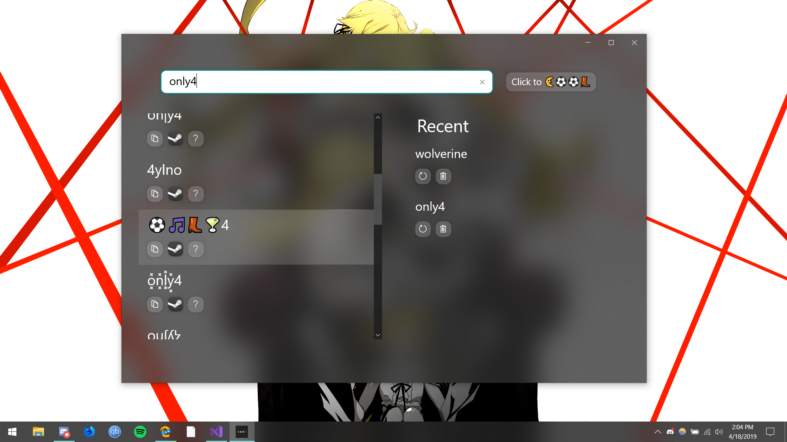
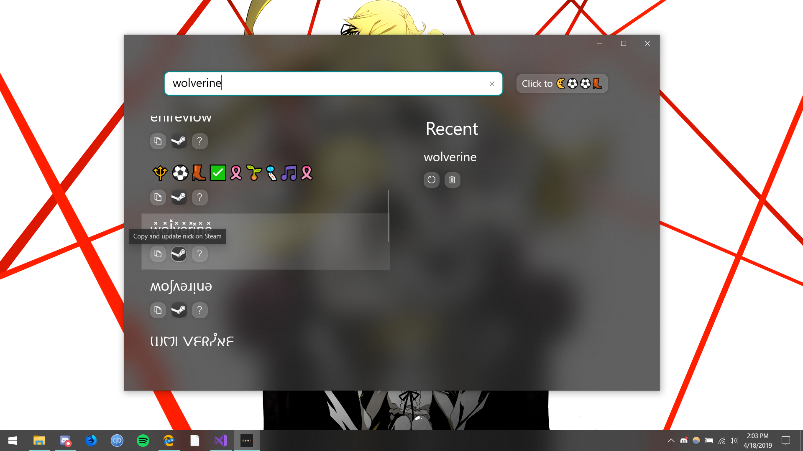

# Cool Text Gen
Cool Text Gen is a UWP app that let's you transform plain text to **"c00l text"**.
## Preview release v0.3.0

    
    

## Screenshots

|               |                   |
|:-------------:| :----------------:|
|  |  |

## Dependencies

* [UWP Community Toolkit](https://github.com/Microsoft/UWPCommunityToolkit)

## Author

[Mohit Kumar Yadav](https://github.com/mohitkyadav)

